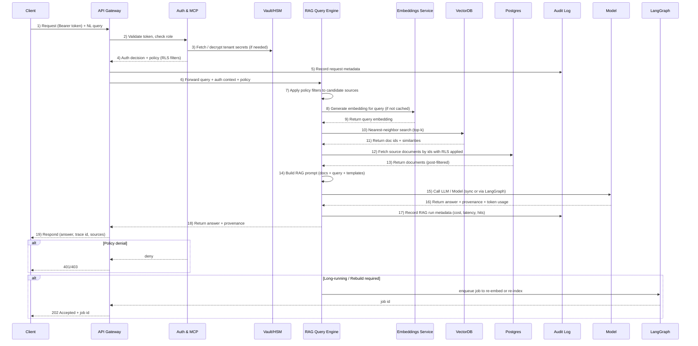

# Naksha Cloud — Unified Architecture Diagram (Extended)

```mermaid
flowchart TB

  %% === EDGE & CLIENT LAYER ===
  subgraph Edge[Edge & Client Layer]
    A1[Web App / Mobile App]
    A2[CLI / SDKs (JS, Python, Go)]
    A3[Local Cache / Offline Sync]
  end

  %% === INGRESS & GATEWAY ===
  subgraph Ingress[API Gateway & Access]
    B1[API Gateway (REST / GraphQL / Streaming)]
    B2[Auth + Policy (MCP + Vault)]
    B3[Rate Limiter / Token Manager]
  end

  %% === ORCHESTRATION LAYER ===
  subgraph Orchestration[LangGraph & Execution]
    C1[LangGraph Orchestrator]
    C2[Function Runner (Containers / Edge Workers)]
    C3[Job Queue + Autoscaler]
  end

  %% === DATA PLANE ===
  subgraph DataPlane[Data Layer]
    D1[Postgres (OLTP)]
    D2[SQLite (Local / Edge)]
    D3[DuckDB (Analytics)]
    D4[VectorDB (Embeddings / Search)]
    D5[S3-compatible Object Storage]
  end

  %% === REALTIME LAYER ===
  subgraph Realtime[Realtime Fabric]
    E1[NATS / Redis Streams]
    E2[Event Bus + CRDT Sync]
  end

  %% === AI & SERVICES LAYER ===
  subgraph AI[AI & Semantic Layer]
    F1[Embeddings Service]
    F2[RAG Query Engine]
    F3[LangGraph Templates / Pipelines]
    F4[AI Policy Builder (MCP)]
  end

  %% === PLATFORM & MARKETPLACE ===
  subgraph Platform[Platform Services]
    G1[CI/CD Templates + IaC]
    G2[Plugin Marketplace]
    G3[Integrations Hub]
    G4[BI Dashboards + Feedback Engine]
  end

  %% === SECURITY & INFRASTRUCTURE ===
  subgraph Infra[Security & Infrastructure]
    H1[Kubernetes Cluster / Node Pools]
    H2[HSM Vault / Secrets Manager]
    H3[Observability Stack (Logs, Metrics, Traces)]
    H4[Audit + Compliance Layer]
  end

  %% === CONNECTIONS ===
  A1 --> B1
  A2 --> B1
  A3 --> D2
  B1 --> B2 --> C1
  C1 --> C2 --> D1
  C1 --> D4
  C1 --> F2
  D1 --> E1 --> E2
  D4 --> F1
  F1 --> F2 --> G4
  G1 --> H1
  G2 --> C1
  G3 --> B1
  G4 --> H3
  B2 --> H2
  H2 --> H4
```

## **Layer Summary**

### **1. Edge & Client Layer**

* Web/mobile apps, SDKs, CLI.
* Offline-first sync via SQLite + cache diffing.

### **2. API Gateway & Auth Layer**

* REST/GraphQL APIs, streaming endpoints.
* MCP + Vault for AI-based policy and secret management.

### **3. Orchestration Layer**

* LangGraph for multi-step task orchestration.
* Function runners for containerized workloads.
* Job queue with autoscaling and tracing.

### **4. Data Plane**

* Postgres (core DB), DuckDB (analytics), SQLite (local), VectorDB (semantic), S3 (object storage).
* Unified query driver and schema sync across engines.

### **5. Realtime Layer**

* NATS/Redis for streaming events, CRDT-ready sync.
* Event bus for live data and function triggers.

### **6. AI & Semantic Layer**

* Embeddings + RAG engine.
* LangGraph templates, MCP policy builder, semantic search.

### **7. Platform Services**

* CI/CD automation, IaC templates, Marketplace for APIs/plugins.
* Integrations Hub for external connectors.
* BI dashboards, AI feedback analytics.

### **8. Security & Infrastructure Layer**

* K8s clusters, Vault secrets, observability, compliance.
* Per-tenant isolation, full audit logs.

## **Key Design Principle**

Unify Supabase-style developer experience with AI-native backend automation, policy generation, and orchestration—built for multi-engine data and semantic workloads.

---

Next recommended deliverable: **Auth → RAG Query Flow (Sequence Diagram)** or **LangGraph Job Lifecycle Flow**. Specify which to generate first.

---

## Auth → RAG Query Flow (Sequence Diagram)



### Notes

* All data access respects MCP-generated policies. RLS filters are applied both at DB query time and post-filtering after vector retrieval.
* Vault/HSM only returns ephemeral secrets to the API or LangGraph runtime. Secrets never included in logs.
* Audit Log stores reproducible metadata: request id, user, policies applied, vector hits, and model cost.
* For latency-sensitive requests use a cached embedding layer and warm model endpoints.

